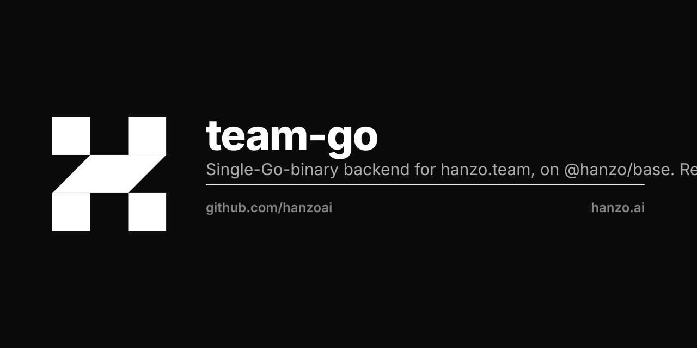

<p align="center"></p>

# hanzo-team

Single-binary Go backend for `hanzo.team`. Replaces the 40+
TypeScript/Node microservices the Huly fork shipped, while keeping the
existing Huly Svelte frontend.

## What this is

```
hanzo-team (one Go process, one port)
├── @hanzo/base               # SQLite + admin UI + JSVM + plugin system
├── platform plugin           # Hanzo IAM auth, KMS, multi-tenant
├── jsvm plugin               # Goja runtime, .fn.ts handlers in goroutines
├── pkg/auth                  # /v1/me, /v1/logout
├── pkg/billing               # /v1/billing/* → commerce.hanzo.ai
├── pkg/bot                   # /v1/bot/*     → hanzo.bot
├── functions/*.fn.ts         # ai, notify, calendar, github, … (one
│                             #   .fn.ts per legacy TS pod)
└── migrations/*.js           # workspaces, projects, tasks
```

Auth: ALL social federation (Google / GitHub / SAML / OIDC) is
configured **inside Hanzo IAM**. team-go never sees it — we are just
an OAuth client.

Billing: Commerce (`commerce.hanzo.ai`) is the single source of truth.
The `/v1/billing/*` surface here is a thin proxy that re-mints the
identity headers from the JWT-validated auth context.

AI: `/v1/bot/*` proxies to `hanzo.bot`. `/v1/ai/complete` (in
`functions/ai.fn.ts`) is a one-shot completion helper.

## Run locally

```bash
cp .env.example .env
# fill in IAM_CLIENT_SECRET if you have it; otherwise you can run
# with `IAM_ENDPOINT=disabled` and use Base's superuser bootstrap.

make dev
# → ./team serve --dev --http :8080
# → http://localhost:8080/_/        Base admin UI
# → http://localhost:8080/v1/       app API surface
```

Migration CLI:

```bash
./team migrate up                       # apply
./team migrate down 1                   # roll back 1 step
./team migrate create add_my_table      # scaffold .js
```

## Build

```bash
make build                              # local binary
make docker                             # ghcr.io/hanzoai/team:dev
```

The Dockerfile produces a distroless image (~30 MB) with the static
Go binary, compiled `.fn.js` and `.js` migrations. No node_modules,
no runtime npm.

## Deploy (prod)

`hanzoai/universe/infra/k8s/team-go/deployment.yaml` pins
`ghcr.io/hanzoai/team:<sem-ver>`. Env values come from the KMS-synced
`team-secret`:

| K8s Secret key       | Env                  |
|----------------------|----------------------|
| `iam_client_id`      | `IAM_CLIENT_ID`      |
| `iam_client_secret`  | `IAM_CLIENT_SECRET`  |
| `iam_endpoint`       | `IAM_ENDPOINT`       |
| `commerce_endpoint`  | `COMMERCE_ENDPOINT`  |
| `bot_endpoint`       | `BOT_ENDPOINT`       |
| `hanzo_api_key`      | `HANZO_API_KEY`      |

Storage: defaults to SQLite at `hz_data/data.db`. For multi-tenant
prod, point Base at Postgres via the standard `BASE_*` env knobs (see
`hanzo/base` docs).

## Porting one TypeScript pod at a time

Each legacy `pods/X/src/__start.ts` becomes one `functions/X.fn.ts`:

```ts
/// <reference path="./types.d.ts" />
routerAdd("POST", "/v1/x/foo", (e) => {
  if (!e.auth) return e.json(401, { error: "auth required" });
  // … your handler …
  return e.json(200, { ok: true });
});
```

`make functions` transpiles to `functions/dist/X.fn.js`; the JSVM
plugin loads them at boot. Each handler executes in a goroutine
against a pre-warmed Goja runtime — no per-pod containers, no
microservice fan-out.

## Layout

```
.
├── cmd/team/main.go        # ~80 lines — boot Base + plugins
├── pkg/auth/auth.go        # /v1/me, /v1/logout
├── pkg/billing/billing.go  # commerce proxy
├── pkg/bot/bot.go          # hanzo.bot proxy
├── functions/
│   ├── types.d.ts          # ambient types for .fn.ts
│   ├── ai.fn.ts
│   └── notify.fn.ts
├── migrations/
│   └── 1747260000_init_collections.js
├── Makefile
├── Dockerfile
├── .env.example
└── README.md
```
